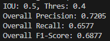

# BDD100K Dataset Analysis, Model Training and Inferencing

# Part1: Streamlit App for Data Processing overview
This project provides a **Streamlit web application** to perform **data analysis on the BDD100K dataset**. It helps visualize the dataset with **bar charts, histograms, and annotated images** showing object detection labels. The app allows users to:

- Analyze **train and validation datasets** (e.g., class distribution, weather, scene conditions).
- Visualize **unique/interesting samples** by drawing bounding boxes on images.
- Provide **conclusions and recommendations** for model training.

The project is containerized using **Docker** to ensure easy deployment and consistent runtime environments.

---

## App Folder Structure
Make sure the **data is mounted correctly** during runtime. Below is the **expected folder structure** for your data and project files:

```bash
/your-project-directory/
│
├── assignment_data_bdd/                    # Dataset directory (mounted to Docker)
│   ├── bdd100k_images_100k/                # Contains all images
│   │   ├── train/
│   │   └── val/
│   │
│   └── bdd100k_labels_release/             # Contains label JSON files
│       ├── bdd100k_labels_images_train.json
│       └── bdd100k_labels_images_val.json
│
├── scripts/                                # Contains app and scripts            
│   └── data_analysis.py                    # (Optional) Additional scripts
│
├── app.py                                  # Streamlit app code
├──  requirements.txt                       # Python dependencies
│
├── plots/                                  # Directory for saved output plots (created automatically)
├── Dockerfile                              # Docker configuration file
└── README.md                               # Project documentation (this file)
```

## Getting Started

### Step 1: Prerequisites
Ensure you have **Docker** installed on your machine. If not, follow the official [Docker installation guide](https://docs.docker.com/get-docker/).

---

### Step 2: Build the Docker Image
In the **root directory** (where your **Dockerfile** is located), run the following command to **build the Docker image**:

```bash
docker build -t streamlit-bdd-app .
```

## How to Run the App

### Step 1: Run the Docker Container with Data Mounting
Use the following command to **run the Docker container** and **mount your dataset directory correctly**:

```bash
docker run -p 8501:8501 -v $(pwd)/assignment_data_bdd:/mnt/data streamlit-bdd-app
 ```   
#### Explanation:
- **`-p 8501:8501`**: Maps **port 8501** inside the container to **port 8501** on your local machine.
- **`-v $(pwd)/assignment_data_bdd:/mnt/data`**: Mounts your **local data directory** to `/mnt/data` inside the container.

### Step 2: Open the App in Your Browser
After running the Docker container, open your browser and go to:
```bash
http://localhost:8501
 ```  

## How to Use the App

1. **Provide Paths from the UI**:
   - **Train JSON**: `/mnt/data/bdd100k_labels_release/bdd100k_labels_images_train.json`
   - **Validation JSON**: `/mnt/data/bdd100k_labels_release/bdd100k_labels_images_val.json`
   - **Image Folder**: `/mnt/data/bdd100k_images_100k/train`

2. **Explore the Features**:
   - **Train Dataset Analysis**: Class distribution, weather conditions, time of day, etc.
   - **Validation Dataset Analysis**: Similar to the train set analysis.
   - **Conclusions and Insights**: Provides recommendations for improving model performance.
   - **Unique Image Samples**: Visualizes 10 annotated images with bounding boxes.

## Troubleshooting

### **Error: `libGL.so.1 not found`**
This is caused by missing OpenCV dependencies. Ensure the **Dockerfile** contains:

```dockerfile
RUN apt-get update && apt-get install -y --no-install-recommends \
    libgl1 \
    libglib2.0-0 \
    && apt-get clean && rm -rf /var/lib/apt/lists/* /tmp/* /var/tmp/*
```

### **Cannot Access App**
- Ensure **Docker** is running and the **correct port (8501)** is mapped.
- Verify that the **data paths in the UI** are correctly referenced as `/mnt/data/...`.

---

# Part2: Comparison Table of Object Detection Models on BDD100K Dataset

| **Model**          | **mAP (%)** | **Inference Time (ms/image)** | **Parameters (Millions)** | **Model Size (MB)** | **Architecture Type**   |
|--------------------|-------------|-------------------------------|---------------------------|---------------------|-------------------------|
| **Faster R-CNN**   | **37.4**    | 100                           | 41                        | 170                 | Two-Stage Detector      |
| RetinaNet          | 35.6        | 80                            | 34                        | 136                 | One-Stage Detector      |
| FCOS               | 35.0        | 70                            | 32                        | 128                 | One-Stage Detector      |
| CenterNet          | 33.0        | 65                            | 21                        | 84                  | One-Stage Detector      |
| DETR               | 35.0        | 200                           | 41                        | 170                 | Transformer-Based       |

**Notes:**

- **mAP (%):** Mean Average Precision on the BDD100K validation set.
- **Inference Time:** Approximate time to process one image during inference.
- **Parameters and Model Size:** Indicative of model complexity and resource requirements.
- **Architecture Type:** Describes the underlying detection approach.

## Reasons to Choose Faster R-CNN over Other Models

### 1. Highest Detection Accuracy

- **Superior mAP:** Faster R-CNN achieves an mAP of **37.4%**, outperforming other models. This translates to more accurate object detection, which is critical for safety and reliability in applications like autonomous driving.
- **Consistent Performance:** Demonstrates robustness across various object sizes and categories, ensuring comprehensive detection capabilities.

### 2. Robust Two-Stage Detection Architecture

- **Precision in Localization and Classification:** The two-stage process first generates region proposals and then classifies them, leading to more precise object localization and classification compared to one-stage detectors.
- **Better Handling of Complex Scenes:** Excels in environments with cluttered backgrounds, occlusions, and overlapping objects common in driving scenarios.

### 3. Extensive Research and Community Support

- **Mature Model:** As one of the pioneering models in object detection, Faster R-CNN has been extensively studied, optimized, and validated by the research community.
- **Abundant Resources:** Availability of pre-trained weights, tutorials, and support forums facilitates easier implementation and troubleshooting.

### 4. Flexibility and Customization

- **Modular Design:** Allows for customization of backbone networks (e.g., ResNet, VGG) and integration of additional features like multi-scale detection.
- **Easy to Fine-Tune:** Pre-trained models can be fine-tuned on specific datasets or classes, saving time and computational resources.

### 5. Enhanced Handling of Class Imbalance

- **Balanced Training Strategy:** The region proposal network (RPN) effectively addresses class imbalance by focusing on potential object regions, improving detection of less frequent classes.
- **Adaptive Anchors:** Utilizes anchor boxes of different scales and aspect ratios, enhancing detection of objects of varying sizes.

### 6. Compatibility with Advanced Techniques

- **Integration with Other Models:** Can be extended to Mask R-CNN for instance segmentation or integrated with attention mechanisms for improved performance.
- **Future-Proof:** Its foundational architecture makes it compatible with ongoing advancements in object detection research.

### 7. Comprehensive Feature Representation

- **Deep Feature Extraction:** Employs powerful backbone networks that capture rich visual features, leading to better recognition of subtle object details.
- **Multi-Layer Processing:** Combines features from multiple convolutional layers to improve detection of both small and large objects.

---

# Faster R-CNN Training and Evaluation

This section contains code for training a Faster R-CNN model on the BDD100K dataset using the ResNet50 backbone with FPN (Feature Pyramid Network).

## Training Folder Structure

```bash
/your-project-directory/faster_rcnn_training/
│
├── config/
│   └── model_config.py             # Configuration file for the model
│
├── scripts/
│   ├── dataset.py                  # Data loading and preprocessing script
│   ├── trainer.py                  # Script to handle the training process
│   └── __init__.py                 # Makes the scripts folder a Python package
│
├── __init__.py                     # Makes the scripts folder a Python package
├── metrics.py                      # Script to calculate evaluation metrics
├── bdd100k_fastrcnn_model.pth      # Pre-trained model checkpoint
└── main.py                         # Main entry point to start the training process
```

## Training Prerequisites

Before starting the training, make sure you have the following dependencies installed:

- **Python 3.8**
- MMCV and MMDetection
- PyTorch (if using GPU, ensure that CUDA is properly configured)
- NumPy

You can install the dependencies using the following command:

```bash
pip install -r requirements.txt
```

## Training the Model

The main script for training is `main.py`. It allows you to configure the training process using various arguments.

To train the model, run the following command from the root directory:

```bash
python main.py \
    --path_to_model_config ./config/model_config.py \
    --path_to_save_trained_model ./output/fasterrcnn_model.pth \
    --path_to_train_dir .assignment_data_bdd/bdd100k_images_100k \
    --path_to_train_json ./assignment_data_bdd/bdd100k_labels_release/bdd100k_labels_images_train.json \
    --device cuda
```
### Arguments

- `--path_to_model_config`: Path to the Python config file that contains training configurations (learning rate, batch size, etc.).
- `--path_to_save_trained_model`: Path to save the trained model once the training is complete.
- `--path_to_train_dir`: Path to the directory containing training images.
- `--path_to_train_json`: Path to the JSON file with the training labels.
- `--device`: Specifies whether to use `cuda` for GPU or `cpu` for CPU.

### Output

During training, the model will save the best checkpoint to the location provided by `--path_to_save_trained_model`.

### Pre-trained Model

A pre-trained Faster R-CNN model checkpoint is provided in `bdd100k_fastrcnn_model.pth`. You can use this checkpoint for inference or further fine-tuning.

## Download Pretrained Weights

You can download the pretrained weights from the following Google Drive link used for inference

[Download Weights](https://drive.google.com/file/d/1unGDXexkPYNHD5O1zITsvdfylOiNUrrx/view?usp=sharing)


## Evaluation

The `metrics.py` is script for evaluating the trained Faster RCNN model. The script runs inference on a set of validation images, compares the predictions to the ground truth annotations, and computes precision, recall, and F1-score metrics for each class, as well as overall metrics across all classes.

### Features
- **Class-wise metrics**: Precision, recall, and F1-score for each object class in the dataset.
- **Overall metrics**: Aggregated precision, recall, and F1-score across all classes.
- **IoU-based matching**: The script matches predicted bounding boxes with ground truth using Intersection over Union (IoU).

### Evaluation Results


---
# YOLO Training (Failed Attempt)

This folder contains an attempt to train a YOLOv8 model on the BDD100K dataset. Unfortunately, the training failed due to issues with the custom dataloader. Here is a brief overview of the folder structure and files included in the project.

## Yolo Training Folder Structure
```bash
/your-project-directory/yolo_training_failed/
├── runs/                       # Output directory for YOLO runs (currently empty due to failure)
│   └── bdd100k.yaml            # YOLOv8 configuration file for BDD100K dataset
│
├── custom_dataloader.py        # Custom dataloader script that encountered issues
├── json_to_yolo_format.py      # Script to convert JSON annotations to YOLO format
├── test_dataloader.py          # Script for testing the dataloader functionality
├── train_yolo.py               # Main script to train YOLOv8 on the dataset
└── yolov8n.pt                  # Pretrained YOLOv8n model weights
```
## Issues

### Custom Dataloader Problem
The `custom_dataloader.py` was created to handle the BDD100K dataset, but encountered issues that led to the failure of the YOLO training process. The exact cause of the problem is still being investigated, and possible debugging steps include:

- Verifying the format of the dataset.
- Ensuring correct conversions between JSON annotations and YOLO format.
- Reviewing the dataloader logic in `custom_dataloader.py`.

### Next Steps
- **Fix the Dataloader**: Review the logic in `custom_dataloader.py` and ensure the dataset is being correctly loaded.
- **Test the Dataloader**: Use `test_dataloader.py` to debug and validate that the data is loaded correctly.
- **Train YOLO**: Once the dataloader is fixed, rerun `train_yolo.py` to train the YOLOv8 model on the BDD100K dataset.

## YOLOv8 Configuration
The `bdd100k.yaml` file contains the configuration for the YOLOv8 model training, specifying dataset paths and other hyperparameters.

## How to Run (once the dataloader is fixed)
1. Ensure all required dependencies are installed.
2. Use the following command to start training YOLOv8:

    ```bash
    python train_yolo.py
    ```
---

# Part3: BDD100K Faster R-CNN Inference & GT/Pred Viewer, and Observations

Streamlit-based tool for visualizing the inference results of a Faster R-CNN model trained on the BDD100K dataset. The app allows users to upload an image and visualize both the inference results and the ground truth (GT) annotations (for validation images). The inference results are obtained using the Faster R-CNN model, and ground truth annotations are overlaid for images in the validation set.

## Inference Folder Structure
Below is the **expected folder structure** for your data and project files:

```bash
/your-project-directory/inference_gt_app/
├── configs                    # Contains configuration files for the Faster R-CNN model
│   ├── _base_
│   │   ├── datasets
│   │   │   └── bdd100k.py     # Dataset configuration for BDD100K
│   │   ├── models
│   │   │   └── faster_rcnn_r50_fpn.py   # Model configuration
│   │   ├── schedules
│   │   │   ├── schedule_1x.py           # Training schedule
│   │   ├── default_runtime.py           # Runtime configuration
├── fast_rcnn_bdd100            # Contains trained model checkpoints for Faster R-CNN
│   ├── faster_rcnn_r50_fpn_1x_det_bdd100k.py    # Config for inference
│   └── faster_rcnn_r50_fpn_1x_det_bdd100k.pth   # Model checkpoint
├── gt_inference_results        # Output folder for generated inference + GT images
├── __init__.py
├── app_gt_inference_viewer.py  # Streamlit application for inference and GT visualization
├── single_image_test.py        # Standalone test script for running inference on a single image
├── test_image_output.jpg       # Example output image
└── test_image.jpg              # Example input image
```

## Prerequisites

Before running the app, make sure you have the following dependencies installed:

- **Python 3.8**
- Streamlit
- MMCV and MMDetection
- PyTorch (if using GPU, ensure that CUDA is properly configured)
- NumPy

**NOTE:** The setup is done for CPU based Inference.

You can install the dependencies using the following command:

```bash
pip install -r requirements.txt
```

## Usage

### Running the Streamlit App
1. To run the Streamlit app and view the inference results:
   ```bash
   streamlit run gt_inference_results/app_gt_inference_viewer.py
   ```
2. In the browser, upload an image to perform inference. The app will display the inference results, and if the image is from the validation set, it will also display the ground truth annotations.

### Running Inference on a Single Image

You can also run inference on a single image without the Streamlit UI by using the `single_image_test.py` script:
You can provide paths to input and output image in the script.

```bash
python gt_inference_results/single_image_test.py 
```
### Output

The app will generate and display two images:

- **Inference Result**: Shows bounding boxes from model predictions.
- **GT Annotations**: Shows ground truth annotations (if available).

These images will also be saved to the `gt_inference_results` folder.

### Model Configuration

The Faster R-CNN model configuration and checkpoint are located in the `fast_rcnn_bdd100` folder:

- **Config file**: `faster_rcnn_r50_fpn_1x_det_bdd100k.py`
- **Checkpoint**: `faster_rcnn_r50_fpn_1x_det_bdd100k.pth`

These files are used to initialize the model for performing inference on the uploaded images.

## Validation Results and Data Analysis Observations

### 1. Small Object Distribution in Training Data
- **Data Analysis**: The training dataset contains a significant number of small objects (such as pedestrians, traffic signs, or distant vehicles), which are more challenging for object detection models to detect accurately.
- **Validation Results**: This leads to fewer detections or missed detections of smaller objects during validation, as Faster R-CNN can struggle with small object localization due to anchor box limitations and the downsampling in convolutional layers.

### 2. Class Imbalance
- **Data Analysis**: The BDD100K dataset has class imbalances, with some classes (e.g., cars, pedestrians) being more frequent than others (e.g., motorcycles, bicycles).
- **Validation Results**: Overfitting to dominant classes can occur, where the model becomes biased towards frequent objects (e.g., cars), resulting in poor performance on less common classes (e.g., motorcycles). Precision and recall metrics for minority classes may be significantly lower.

### 3. Day vs. Night Scene Distribution
- **Data Analysis**: The dataset includes both day and night scenes, but there may be more daylight images in the training set.
- **Validation Results**: This imbalance can lead to weaker performance in night scenes, where low-light conditions present a different challenge for object detection, resulting in higher false negatives or reduced accuracy on night-time validation images.

### 4. Occlusion and Crowded Scenes
- **Data Analysis**: Some objects in the training dataset may be occluded or located in crowded environments, where multiple objects overlap or are partially visible.
- **Validation Results**: This could result in false negatives or incorrect bounding box predictions in occluded/crowded scenes, as Faster R-CNN may struggle to separate or distinguish individual objects in complex scenes.

### 5. Diversity of Weather Conditions
- **Data Analysis**: The BDD100K dataset contains varied weather conditions (clear, rainy, foggy, snowy), but certain weather types (like foggy or snowy) might have fewer samples.
- **Validation Results**: The model may exhibit lower accuracy in detecting objects under less-represented weather conditions, leading to higher error rates in validation for foggy or snowy scenes, especially in detecting objects with low contrast.

### 6. Image Resolution and Scaling
- **Data Analysis**: The BDD100K dataset consists of high-resolution images, but smaller objects in the images may not cover enough pixels for the detector to learn effective features.
- **Validation Results**: Faster R-CNN may have difficulty detecting objects that occupy very small regions of the image, leading to missed detections or inaccurate bounding boxes for small, distant objects in the validation phase.

### 7. Bounding Box Quality in Annotations
- **Data Analysis**: The quality of bounding box annotations in the dataset can vary, with some annotations being tight or loose around the objects.
- **Validation Results**: Inconsistent bounding box annotations can lead to poor localization performance during validation, where predicted boxes may have low Intersection over Union (IoU) with ground truth boxes, affecting both precision and recall.

### 8. Contextual Variability in Scenes
- **Data Analysis**: The dataset includes a wide range of road scenes (urban, rural, highway, etc.) with different contextual backgrounds, which can affect how objects are detected.
- **Validation Results**: The model may perform better in certain scene types (e.g., urban environments with clear, distinct objects) but may have difficulty generalizing to other contexts (e.g., rural or highway scenes), leading to reduced performance in validation on scenes that were underrepresented in training.

### 9. Class Label Noise
- **Data Analysis**: Some class labels in the dataset may contain noise, such as mislabeling or ambiguous object classes (e.g., misclassifying a motorcycle as a bicycle or vice versa).
- **Validation Results**: This can result in classification errors during validation, where the model incorrectly predicts the object class, especially for classes that are visually similar or often mislabeled in the training data.

### 10. Edge Cases and Rare Objects
- **Data Analysis**: There are certain edge cases or rare objects in the dataset (e.g., unusual vehicles, atypical road signs) that appear infrequently in training data.
- **Validation Results**: These rare object categories might be poorly detected or completely missed during validation, as the model has not seen enough instances of these objects to generalize well, leading to lower recall for such edge cases.

## Model Improvement Ideas/Suggestions

### 1. Handling Small Objects
- **Issue**: The model struggles with detecting smaller objects due to their limited presence in training data.
- **Improvement**:
  - **Anchor Box Tuning**: Adjust the scales and aspect ratios of anchor boxes in Faster R-CNN to better match the size distribution of small objects.
  - **Data Augmentation**: Use techniques like image resizing, zoom-in augmentation, or cropping around small objects to emphasize small object detection during training.
  - **FPN (Feature Pyramid Network)**: Incorporate an FPN architecture to improve multi-scale feature extraction, especially for small objects.

### 2. Addressing Class Imbalance
- **Issue**: The model is biased toward frequent object classes (e.g., cars) and performs poorly on less common classes (e.g., motorcycles).
- **Improvement**:
  - **Re-sampling or Over-sampling**: Use techniques like class re-sampling or data augmentation to artificially increase the representation of minority classes.
  - **Loss Function Modification**: Implement focal loss or weighted cross-entropy loss to down-weight the contribution of the majority classes and up-weight the minority classes.

### 3. Improving Night Scene Detection
- **Issue**: Model performance is weaker on night-time scenes due to the imbalance of day vs. night data and the challenge of low-light conditions.
- **Improvement**:
  - **Data Augmentation**: Apply synthetic data augmentation techniques, such as changing brightness/contrast, to simulate night-time conditions in the training images.
  - **Use Pretrained Models**: Fine-tune the model using pretrained weights on datasets that contain night-time or low-light scenes (e.g., COCO dataset).
  - **Domain-Specific Fine-Tuning**: Train separate sub-models for day and night scenes or apply a domain-adaptation approach that adapts the model to night-time conditions.

### 4. Improving Detection in Occluded and Crowded Scenes
- **Issue**: Occlusion and crowded environments lead to missed or incorrect detections as the model struggles to differentiate between overlapping objects.
- **Improvement**:
  - **Context-Aware Features**: Improve contextual understanding by using region-based attention mechanisms that help the model focus on key areas and separate overlapping objects.
  - **Bounding Box Refinement**: Post-processing methods like non-maximum suppression (NMS) tuning can help mitigate missed detections in crowded scenes by refining overlapping box predictions.
  - **Crowd-Specific Data Augmentation**: Create augmented samples with artificially crowded scenes to improve the model’s robustness to occlusion during training.

### 5. Handling Diverse Weather Conditions
- **Issue**: The model performs poorly in certain weather conditions, such as foggy or rainy scenes, because these conditions are underrepresented in the training data.
- **Improvement**:
  - **Weather-Specific Data Augmentation**: Apply weather augmentation techniques (e.g., simulating fog, rain, snow) to make the model more robust to different weather conditions.
  - **Adversarial Training**: Use adversarial data augmentation to expose the model to harder weather-based edge cases, improving generalization to unseen weather conditions.
  - **Pretrained Models**: Fine-tune the model on datasets with diverse weather conditions or use pretrained models that have been trained on weather-rich datasets.

## Contributing
If you’d like to contribute to this project, feel free to **fork the repository** and submit a **pull request**.

## License
This project is licensed under the **MIT License**.

## Author
Somya's **BDD100K Dataset Analysis and Model Training App** – 2024